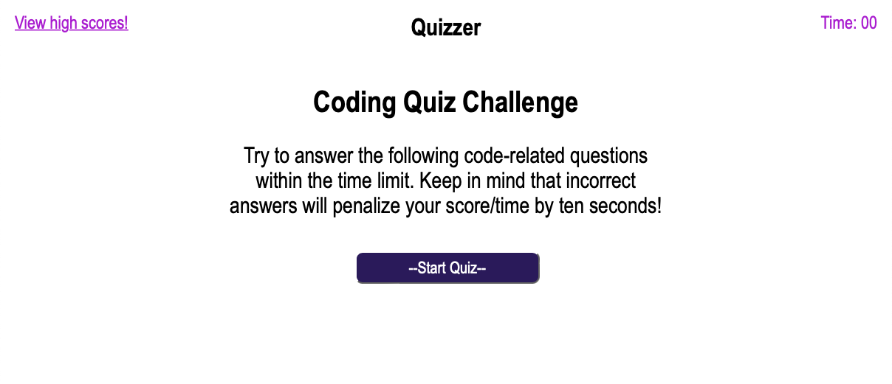

# Quizzer

## Description
Java Script and DOM based Quiz with timed and score card features--

    A timed coding quiz with multiple-choice questions. 
    This app will run in the browser, and will feature dynamically updated HTML and CSS powered by JavaScript 

## Table of Contents (Optional)

If your README is long, add a table of contents to make it easy for users to find what they need.

- [Installation](#installation)
- [Usage](#usage)
- [Credits](#credits)
- [License](#license)

## Installation

Download content folder enjoy!

## Usage
Site Link---  (https://frozzel.github.io/Quizzer/)

    
## Credits
Dennis Hickox (https://github.com/frozzel)

w3Schools (https://www.w3schools.com/js/js_objects.asp)

dofactory  https://www.dofactory.com/javascript/function-objects)

w3Schools (https://www.w3schools.com/Js/js_object_display.asp)

w3Schools  (https://www.w3schools.com/jsref/jsref_forEach.asp)

## License

YOu Can Do What Ever yOu lIkE ;)

---
